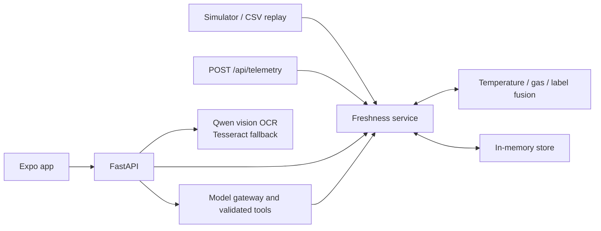

# Freshness Tracker

A food freshness prototype with a Python engine, FastAPI backend, telemetry
simulator, and Expo mobile app. The app includes an inventory dashboard, telemetry
and alerts, item details and editing, manual entry, label scanning with editable
OCR results, and a local-model assistant.

This is a waste-reduction prototype, not a food-safety device. Food-profile
coefficients are placeholders. Only the temperature track originates remaining
freshness; gas and color-label signals can only shorten it.

## Backend setup

Use Python 3.12 or newer. From the repository root:

```sh
python3 -m venv .venv
source .venv/bin/activate
python -m pip install -e '.[dev]'
cp .env.example .env
python -m uvicorn apps.api.main:app --host 0.0.0.0 --port 8010 --env-file .env
```

On Windows, create the environment with `py -3.14 -m venv .venv` (or another
installed Python 3.12+), activate it with `.\.venv\Scripts\Activate.ps1`, and use
`Copy-Item .env.example .env` instead of `cp`.

The API documentation is at <http://localhost:8010/docs>. Inventory and telemetry
are held in memory and reset when the server restarts.

Label scanning uses the local `qwen3.5:9b` model as a structured vision extractor.
A scan can combine up to five photos of the same package, so the front label, date
stamp, size, and lot code can be captured from different views. Qwen transcribes the
photos together, returns only fields grounded in that transcription, and leaves every
field editable before an item is created. PNG/JPEG and HEIC photos are supported.
Configure the model with the `OCR_*` values in the root `.env`.

Qwen failures are returned to the app instead of silently switching OCR engines.
`OCR_ENGINE=tesseract` remains an explicit legacy single-photo mode for development
and deterministic OCR tests; it requires the **Tesseract executable** on PATH.

The assistant needs a separately running OpenAI-compatible model server. The
default configuration uses [Ollama](https://ollama.com) on port **11434** with
the tool-capable `qwen3.5:9b` model:

```sh
ollama pull qwen3.5:9b
ollama show qwen3.5:9b
```

The `ollama show` output must list `tools` under capabilities. Start Ollama before
using the assistant; the Freshness API continues to use port **8010**. The backend
automatically loads `LLM_BASE_URL`, `LLM_MODEL`, and `LLM_API_KEY` from the root
`.env`. Shell environment variables take precedence. Compatible servers such as
LM Studio and oMLX can be selected by changing those values; the legacy `OMLX_*`
names remain supported as fallbacks. Other API features work without a model
server.

## Mobile setup

Use Node.js 22.13 or newer, as required by [Expo SDK 57](https://docs.expo.dev/versions/v57.0.0/).
In another terminal:

```sh
cd apps/mobile
npm ci
cp .env.example .env
# Edit EXPO_PUBLIC_API_BASE_URL before starting Expo.
npx expo start
```

For a physical phone, set `EXPO_PUBLIC_API_BASE_URL` to
`http://YOUR_LAPTOP_LAN_IP:8010/api`. Find the laptop's address with
`ipconfig getifaddr en0` on macOS or `ipconfig` on Windows. The phone and laptop
must share a network that permits device-to-device traffic. `localhost` on a
phone refers to the phone, not the laptop. Allow the backend through the laptop's
firewall and restart Expo after changing the environment file.

Open the app using an Expo Go version compatible with SDK 57 or a development
build. See the [mobile guide](apps/mobile/README.md) for verification and known
platform limitations.

## Demo and dataset replay

The API starts with demo inventory. Start a synthetic scenario:

```sh
curl -X POST http://127.0.0.1:8010/api/demo/scenarios/hot_car/start
curl http://127.0.0.1:8010/api/state
```

Available scenarios: `normal`, `hot_car`, `door_open`, `spoilage`, `contradiction`,
and `past_budget_quiet`. The dashboard displays telemetry and item estimates;
scenario controls are API-only.

```sh
curl -X POST http://127.0.0.1:8010/api/demo/stop
curl -X POST http://127.0.0.1:8010/api/demo/reset
```

Reset replaces inventory and telemetry with demo state. For CSV replay, put a
compatible file under `FRESHNESS_DATA_DIR` (default `./data`), then run:

```sh
curl -X POST http://127.0.0.1:8010/api/demo/replay \
  -H 'Content-Type: application/json' \
  -d '{"path":"beef.csv","sensor_column":"MQ135"}'
```

The adapter requires `Minute`, `Temperature`, `Humidity`, and the selected `MQ*`
column. Replay replaces demo state. Dataset files are not distributed here.
Replay exercises the pipeline; it does not validate BME680 performance or train
a model. Check dataset units before interpreting replayed gas values.

## Verification

```sh
# Repository root, with the Python environment activated
python -m pytest -q

# Mobile directory
cd apps/mobile
npx tsc --noEmit
npx expo export --platform all
```

Python tests cover engine behavior, simulation/replay, inventory actions, API
validation, real OCR, and mocked model-server responses. Export verifies bundling;
physical camera permissions, uploads, and native navigation need device testing.

## Project layout and architecture

| Directory | Responsibility |
| --- | --- |
| `engine/` | Temperature-time calculations, gas baseline, signal fusion, food profiles |
| `simulator/` | Synthetic scenarios and CSV replay |
| `apps/api/` | HTTP routes, in-memory service, OCR, assistant tools |
| `apps/mobile/` | Expo routes, shared components, API client |
| `hardware code/` | CircuitPython sensor readout prototype and bundled libraries |
| `tests/` | Python engine, simulator, and API tests |
| `docs/` | Architecture, team handoff, and demo guide |



The simulator calls the same service ingestion method as the telemetry endpoint;
it does not make HTTP requests. The hardware prototype currently prints sensor
readings every two seconds. It does **not** upload telemetry or connect to the app.
Hardware ingestion, persistence, shared-fridge gas semantics, and model calibration
remain future work.

See the [architecture guide](docs/architecture.md),
[team handoff](docs/freshness-tracker-team-plan.md), and
[digital demo guide](docs/digital-prototype-plan.md).
