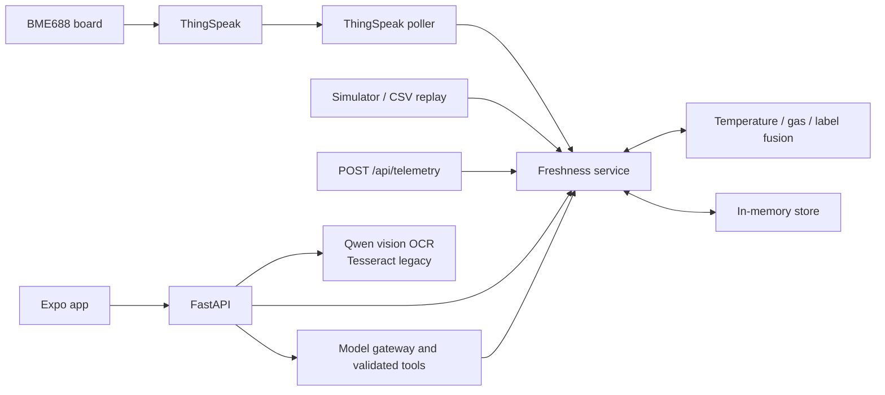

<p align="center">
  
</p>

# Freshness Tracker

<p align="center">
  <a href="https://www.youtube.com/watch?v=7eOdVOMNjco">Demo video</a> ·
  <a href="https://devpost.com/software/claudius-maximus">Devpost</a>
</p>

A food-freshness prototype: a Python freshness engine, a FastAPI backend, a
telemetry simulator, an Expo mobile app, and a BME688 sennsor that uploads to
ThingSpeak.

This is an experimental waste-reduction prototype. Five profiles use USDA FSIS
storage guidance; four remain placeholders. Days left use recorded temperature exposure and
project future storage at 4C. Display rounds down to whole days or less than one
day. A warm fridge also gets a current-conditions correction and an aging-rate
readout, both prospective what-ifs that never undo accrued exposure. Gas is an
experimental fridge-level signal with no influence on estimates.

Run only one API worker for one household. There is no account isolation or
authentication. Do not deploy multiple processes against the same SQLite file:
each process owns an in-memory snapshot that can overwrite another process.
Keep the demo on a trusted local network. This limit is documented, not fixed.

## Problem and solution (STAR)

### Situation

Households throw away food because they cannot tell when it is still good. The
only signal they get is a printed date, and that date assumes the food has been
kept cold the whole time. It does not know about the warm car ride home, a
fridge door left open, or a fridge that runs warm. Spoilage speed is strongly
temperature-dependent, so two identical packs with the same date can have very
different real lives. People compensate by guessing: they either discard food
that was fine (waste) or keep food too long (a safety risk).

### Task

Build a prototype that answers "how many days does this item have left?" from
what actually happened to it, and does so honestly. The requirements were:

- Estimate remaining freshness per item from **measured temperature exposure**,
  not just the label date.
- Use a cheap in-fridge gas sensor (BME688) and a label color score as extra
  evidence, but never let them make food look **fresher** than the temperature
  record supports.
- Make entry low-effort (scan a label with the phone camera) and warn the user
  before food is lost.
- Never invent numbers. Every freshness figure must come from the engine, even
  when a language-model assistant is talking to the user.
- Stay clear about scope: this is a waste-reduction aid, **not a food-safety
  device**.

### Action

| Piece | What was built |
| --- | --- |
| Freshness engine (`engine/`) | Pure functions. **Track A** integrates temperature into an effective-age budget with a Q10 rate multiplier relative to 4 C, so time spent warm burns more life. **Track B** fits a gas baseline on temperature and humidity and scores anomalies. **Track C** is a manual color-label score. `fusion.fuse` lets B and C only **shorten** Track A's days or veto to 0, and derives a confidence value and a status (`fresh`, `check_early`, `past_budget_quiet`, `discard_quality_signal`). |
| Evidence-based profiles | `engine/foods.json` holds per-category `d0_days` from USDA FSIS cold-storage guidance for five categories, and a Q10 of 2.7 fitted (R^2 = 0.9997) to published chicken shelf-life at 0, 4, 10 and 15 C. See [Profile provenance](#profile-provenance). |
| Hardware | A BME688 board (`hardware/sketch.cpp`) reads temperature, humidity and gas and uploads to ThingSpeak every 1 minute. The API polls that channel. |
| Backend (`apps/api/`) | FastAPI service that owns state. All telemetry sources (HTTP, ThingSpeak, simulator, CSV replay) go through one `service.ingest`, and alerts are recomputed from scratch on every change so they cannot drift. Optional SQLite persistence. |
| Safe failure | Stale data (older than 3 minutes) shows as disconnected. Exposure outside -1 C to 25 C stops integration and withholds the estimate instead of guessing. Aging-rate and storage-temperature advice return "unavailable" rather than a fabricated 1.0x. |
| Label scanning | Up to 5 photos go to a local Qwen vision model (Tesseract as a legacy option). The user reviews and edits every field and picks the category before the item is created. |
| Assistant | A local tool-calling model that can act only through validated tools. It reads engine output and never produces freshness numbers itself. |
| Mobile app (`apps/mobile/`) | Expo app with a fridge dashboard, item details, notifications, manual add, label scan, voice-capable assistant, Celsius/Fahrenheit and theme settings, and an in-app manual. |
| Simulator and tests | Six scripted scenarios (`normal`, `hot_car`, `door_open`, `spoilage`, `contradiction`, `past_budget_quiet`) plus CSV replay let the whole pipeline run without a fridge. Pytest suites cover the engine, simulator and API. |

### Result

- A working end-to-end prototype: sensor to ThingSpeak to API to phone, with
  per-item days left, a status, a confidence level and alerts.
- The core design invariant holds and is tested: extra signals can only
  **shorten** an estimate, so the system errs toward caution rather than false
  reassurance.
- Estimates degrade visibly (disconnected, unavailable, withheld) instead of
  showing a confident wrong number.
- The demo runs fully offline from simulated scenarios, and the assistant and
  OCR run on local models, so no data leaves the household network.
- **Honest limits:** four of nine profiles are still placeholders, and the Q10
  fit uses poultry data reused for other categories. Gas is experimental and has
  no influence on estimates by default. There is no authentication, no
  multi-fridge support, no clinical or safety validation, and no automated
  mobile UI tests. No accuracy claim is made until the model is calibrated
  against real spoilage data. See [Known limitations](#known-limitations).

## Current state

| Area | Status |
| --- | --- |
| Freshness engine | Working. Temperature (Q10 budget), gas anomaly and color-label tracks, fused. Only the temperature track sets remaining freshness; gas and color can only **shorten** it or veto to 0. |
| Backend API | Working. Items, telemetry, alerts, OCR, assistant, demo control. **All state is in memory** unless `FRESHNESS_DB_PATH` is set. Nothing is seeded: live and demo inventories both start empty. |
| Live telemetry | Optional. The API polls a ThingSpeak channel when `THINGSPEAK_CHANNEL_ID` is set. The sensor has no door switch, so every live sample counts as door-closed. Gas comes from the firmware's field4 and only counts when its field7 flags are 63 (all hardware flags set, `iaq_accuracy` 3); below that only the temperature track runs. |
| Simulator | Working. Synthetic scenarios and Mendeley-style CSV replay, both feeding `service.ingest` directly. |
| Mobile app | Working on iOS/Android. Fridge dashboard (grid/list), notifications screen, item details (rename, category, mark opened, label score, delete, aging rate, current-conditions correction, storage-temperature suggestion), manual add, multi-photo label scan, voice-capable assistant, persistent Celsius/Fahrenheit and theme settings, in-app user manual, splash overlay. No auth or durable inventory; the API owns inventory state. |
| Label scan (OCR) | Qwen vision model via Ollama by default (up to 5 photos, all fields editable before confirm). Tesseract is an explicit legacy single-photo mode. |
| Assistant | Local OpenAI-compatible tool-calling model (default Ollama `qwen3.5:9b`). It can only act through validated tools and never produces freshness numbers itself. |
| Hardware | `hardware/sketch.cpp` (Arduino/BSEC2, WiFi) uploads readings to ThingSpeak every 1 minute. CAD in `hardware/STL_files/`. The API reads that channel; the board never talks to the API directly. |
| Not built | Persistence, authentication, shared-fridge gas semantics, model calibration/validation, automated mobile UI tests. |

## Profile provenance

`engine/foods.json` carries a `source` per category. Five categories use
published guidance; four remain `placeholder` demo coefficients.

**D0 (unopened shelf life at 4C) — USDA FSIS cold storage guidance:**

| Category | FSIS guidance | `d0_days` |
| --- | --- | --- |
| Red meat (beef/pork/lamb) | 3-5 days | 4.0 |
| Poultry | 2 days | 2.0 |
| Seafood / fish | 2 days | 2.0 |
| Eggs (in shell) | 3-5 weeks | 28.0 |
| Dairy (milk) | 5-7 days | 6.0 |

Ground meat also falls under the FSIS 2-day guidance; it is currently folded
into `red_meat` (4.0 days) rather than split out, so ground cuts are the
optimistic end of that profile.

**Q10 = 2.7 (`q10_source: fitted-published-multitemp`):** fitted by log-linear
regression of published chicken sensory shelf-life against storage temperature:

| Temperature | Shelf life (days) |
| --- | --- |
| 0 C | 13.33 |
| 4 C | 9.17 |
| 10 C | 5.00 |
| 15 C | 3.00 |

R^2 = 0.9997. The fit is on poultry data and is reused for red meat, seafood
and dairy as the best available multi-temperature estimate; it is not
independently validated for those categories. Eggs keep q10 2.0 and the four
placeholder categories keep their demo values, none of which are fitted.

## Tech stack

| Layer | Technology |
| --- | --- |
| Freshness engine | Python 3.12+, NumPy, SciPy (Q10 budget, gas baseline fit) |
| Backend | FastAPI, Uvicorn, Pydantic, httpx, python-dotenv, python-multipart; in-memory store with optional SQLite persistence |
| Label scanning | Qwen vision model via Ollama (default); Tesseract with pytesseract, Pillow and pillow-heif (legacy mode) |
| Assistant | Local OpenAI-compatible tool-calling model (Ollama, `qwen3.5:9b`) |
| Mobile app | Expo SDK 57, React Native 0.86, React 19, TypeScript, Expo Router, Reanimated, AsyncStorage, expo-speech-recognition |
| Hardware | BME688 gas sensor, ESP32 (Arduino C++), Bosch BSEC2, 3D-printed enclosure (STL) |
| Cloud and data | ThingSpeak channel for sensor upload, polled by the API |
| Simulation and testing | Scripted scenarios, Mendeley-style CSV replay, pytest, `tsc --noEmit` |

## Repository layout

| Path | Responsibility |
| --- | --- |
| `engine/` | Pure freshness functions (`burn.py`, `gas.py`, `conditioning.py`, `fusion.py`) and `foods.json` profiles |
| `apps/api/` | FastAPI app: `main.py` routes, `service.py` logic, `store.py` state, `schemas.py`, `ocr.py` / `vision_ocr.py`, `thingspeak.py`, `llm/` (gateway + tools) |
| `simulator/` | `scenarios.json`, scenario generator, CSV replay |
| `apps/mobile/` | Expo SDK 57 app (`src/app` routes, `src/components`, `src/lib`) |
| `hardware/` | ESP32 sketch, vendored libraries, 3D-print enclosure files |
| `tests/` | `engine/`, `simulator/`, `api/` pytest suites |



## Setup

### Backend

Python 3.12+, from the repo root:

```sh
python3 -m venv .venv
source .venv/bin/activate
python -m pip install -e '.[dev]'
cp .env.example .env
python -m uvicorn apps.api.main:app --host 0.0.0.0 --port 8010 --env-file .env
```

API docs: <http://localhost:8010/docs>. On Windows, activate with
`.\.venv\Scripts\Activate.ps1` and use `Copy-Item` instead of `cp`.

The API documentation is at <http://localhost:8010/docs>. Set
`FRESHNESS_DB_PATH=./data/freshness.sqlite3` in the root `.env` to persist live
inventory and telemetry. Without this setting, storage is in memory.
Demo routes use a separate service and `${FRESHNESS_DB_PATH}.demo` database
(or a separate in-memory store when persistence is not configured).
The mobile dashboard reads live state; demo state is at `/api/demo/state`.

Keep `ENABLE_EXPERIMENTAL_FUSION=false` for the demo. The legacy gas/label
weighting and veto code remains behind that opt-in flag. Sigma values and the
calibration JSON loader are unused when the flag is off; the API reports this.
`engine/gas_calibrate.py` is NOT FOR REPORTING: its model selection and accuracy
metrics need correction. Generated artifacts carry `reportable: false` and are
rejected as sources of fusion uncertainty.

The telemetry buffer retains about 3,000 raw readings (about 50 hours at 1 minute).
Every accepted reading updates temperature exposure; readings are not downsampled
for integration. Data older than three minutes is displayed as disconnected.
Exposure outside -1C through 25C stops integration for that interval and leaves a
persisted warning. The UI withholds the estimate because that exposure is unknown.
Category changes replay retained temperatures using the new Q10. If accrued
exposure predates retained history, the API refuses the category change.

Key `.env` values (see `.env.example` for all):

| Variable | Purpose |
| --- | --- |
| `LLM_BASE_URL`, `LLM_MODEL`, `LLM_API_KEY` | Assistant model server (legacy `OMLX_*` names still work as fallbacks) |
| `OCR_ENGINE`, `OCR_BASE_URL`, `OCR_MODEL`, `OCR_TIMEOUT_SECONDS`, `OCR_KEEP_ALIVE` | Label scanning (`qwen` or `tesseract`) |
| `THINGSPEAK_CHANNEL_ID`, `THINGSPEAK_READ_API_KEY`, `THINGSPEAK_POLL_SECONDS` | Optional live telemetry; leave the channel blank to disable |
| `FRESHNESS_DATA_DIR` | Where CSV replay files live (default `./data`) |

`apps/api/config.py` loads the root `.env` on import; real environment variables win.
Qwen requests have a 15-second deadline; failures open manual entry in the app.
After OCR the user must explicitly tap a category before confirming the item.
`OCR_ENGINE=tesseract` remains an explicit legacy single-photo mode for development
and deterministic OCR tests; it requires the **Tesseract executable** on PATH.

### Model server (assistant and scanning)

Both use [Ollama](https://ollama.com) by default:

```sh
ollama pull qwen3.5:9b
ollama show qwen3.5:9b     # must list "tools" under capabilities
```

Start Ollama before using the assistant or Scan tab. Everything else works without it.
Qwen failures are returned to the app; they do not silently fall back to Tesseract.
`OCR_ENGINE=tesseract` needs the `tesseract` binary (`brew install tesseract`).

### Mobile

Node 22.13+:

```sh
cd apps/mobile
npm ci
cp .env.example .env
npx expo start
```

Set `EXPO_PUBLIC_API_BASE_URL=http://<laptop LAN IP>:8010/api` in `apps/mobile/.env`
(`ipconfig getifaddr en0` on macOS). `localhost` on a phone is the phone. Restart
Expo after changing it.

Voice input uses a native speech module, so it needs a development or release
build, not Expo Go.

### Standalone iOS build on a physical iPhone

Needs full Xcode, an Apple ID under Xcode Settings → Accounts, and Developer Mode on
the phone.

```sh
cd apps/mobile
npm run ios                        # Release build + install (scripts/ios-device.sh)
IOS_DEVICE=<udid> npm run ios      # another phone: xcrun devicectl list devices
npx expo prebuild --platform ios   # only after app.json or native-dependency changes
(cd ios && pod install)
```

- Do **not** use `npx expo run:ios`: it forces parallel codesigning, which fails here
  with `errSecInternalComponent` and yields an app that builds but won't install.
  `scripts/ios-device.sh` signs serially and verifies every framework.
- `ios/` is generated and gitignored. Edit `app.json`, never the Xcode project.
  Signing lives in `ios.appleTeamId`; `plugins/with-script-sandbox-disabled.js`
  reapplies the setting the Metro bundling phase needs on each prebuild.
- Release embeds the JS bundle, so no Metro is needed, but the backend must be
  reachable at `EXPO_PUBLIC_API_BASE_URL`. Free Apple ID signing expires after 7 days.
- If `app.json` icons/logo change, rerun `python scripts/build-icons.py`.

## Demo and replay

The demo service is isolated from live state and also starts empty — add items
through the API or the app before starting a scenario. Demo control is API-only:

```sh
curl -X POST http://127.0.0.1:8010/api/demo/scenarios/hot_car/start
curl http://127.0.0.1:8010/api/demo/state
```

```sh
curl -X POST http://127.0.0.1:8010/api/demo/stop
curl -X POST http://127.0.0.1:8010/api/demo/reset
```

Scenarios: `normal`, `hot_car`, `door_open`, `spoilage`, `contradiction`,
`past_budget_quiet`. Reset clears telemetry, alerts and the gas baseline and
restores every existing item's freshness budget; it does not add or remove items.

CSV replay (file under `FRESHNESS_DATA_DIR`, columns `Minute`, `Temperature`,
`Humidity` and an `MQ*` column):

```sh
curl -X POST http://127.0.0.1:8010/api/demo/replay \
  -H 'Content-Type: application/json' \
  -d '{"path":"beef.csv","sensor_column":"MQ135"}'
```

Datasets are not distributed. Replay exercises the pipeline; it does not validate
BME680/688 performance. Check units before interpreting replayed gas values.

## Development guide

### Verify

```sh
python -m pytest -q                                   # backend, from repo root
python -m pytest tests/engine/test_fusion.py -q       # one file
cd apps/mobile && npx tsc --noEmit                    # types
cd apps/mobile && npx expo export --platform all      # bundling check, not a device test
```

Tests run real Tesseract on rendered label images (needs the binary). LLM tests
monkeypatch `LLMGateway._chat`, so no model server is needed. Tests that need
isolated state monkeypatch `main.service` and `main.simulator` (see
`tests/api/test_replay_api.py`); otherwise they share the global singleton.

### Rules to keep

- **Engine invariant:** tracks B and C may only shorten Track A's days or veto to 0.
  `engine/` stays pure (no I/O beyond loading `foods.json`).
- **Aging rate and storage optimization** are Track A only: `current_aging_rate`
  (`engine/burn.py`) and `FreshnessService._storage_optimization` compare the
  current reading against the 4C reference. They are prospective what-ifs and
  never undo accrued exposure. Both yield `None` / `temperature_action:
  "unavailable"` when the reading is missing, stale or outside the modelled
  range — never a fabricated 1.0x.
- **Alerts** are recomputed from scratch by `_refresh_alerts()`. Any service
  mutation that affects freshness must call it.
- **All telemetry goes through `service.ingest`** (HTTP, simulator, replay,
  ThingSpeak poller).
- **Routes stay thin:** `KeyError` → 404, `ValueError` → 400; validation lives in
  `schemas.py`.
- **Assistant:** the model never produces freshness numbers. To add a tool, add an
  entry to `TOOL_SCHEMAS` and a matching `_tool_<name>` in `apps/api/llm/tools.py`.
- **OCR contract:** scan → user edits → `/api/ocr/confirm`. Parsing can change
  without changing that contract. Scan stores a 512 px thumbnail keyed by `scan_id`.
- **Mobile:** all backend calls go through `src/lib/api.ts` (12 s timeout; scans have
  their own longer deadline). `src/lib/types.ts` mirrors backend schemas by hand,
  so change both together. Food categories come from `GET /api/profiles`; never
  hardcode them. Styles use `useStyles(makeStyles)` from `src/lib/theme.tsx`;
  colors can't be read at module scope.
- Read the [Expo SDK 57 docs](https://docs.expo.dev/versions/v57.0.0/) before
  changing SDK integrations.

### Common tasks

- **Add a food profile:** edit `engine/foods.json`; the app picks it up via `/api/profiles`.
- **Change an API shape:** update `apps/api/schemas.py`, the route, `apps/mobile/src/lib/types.ts`
  and `api.ts`, and add a test under `tests/api/`.
- **Add a scenario:** add it to `simulator/scenarios.json` and `scenarios.py`, with a test in
  `tests/simulator/`.

### Hardware

`hardware/sketch.cpp` reads a BME688 through BSEC2 and posts to ThingSpeak every
1 minute after a ~5 minute calibration. Set the WiFi SSID and write key in the sketch
constants for your own channel; keep real keys out of git. `hardware/lib/` holds
vendored libraries; don't edit them.

## Known limitations

No persistence or auth; placeholder coefficients; no shared-fridge gas semantics;
no automated mobile interaction tests; web preview lacks OCR upload and item
deletion.

## Sources and references

Only sources that appear in this repository are listed. Nothing here is a
validation of the model.

**Food storage data**

- USDA Food Safety and Inspection Service (FSIS), cold food storage guidance. Source of the
  `d0_days` values for red meat, poultry, seafood, eggs and dairy
  (`"source": "usda-fsis"` in `engine/foods.json`, table under
  [Profile provenance](#profile-provenance)).
- USDA FSIS FoodKeeper data, <https://catalog.data.gov/dataset/fsis-foodkeeper-data>.
  Loaded by `engine/foodkeeper.py`, which uses the midpoint of the catalog's
  `dop_refrigerate` range.

**Temperature model**

- Q10 rate model, reference temperature 4 C (`engine/burn.py`).
- Q10 = 2.7, fitted by log-linear regression of published chicken sensory
  shelf life at 0, 4, 10 and 15 C (13.33, 9.17, 5.00, 3.00 days; R^2 = 0.9997).
  **The publication for these four values is not recorded in the repo.** Add the
  full citation here before relying on or presenting this number.
- ComBase growth-rate observations (`engine/q10_fit.py`). The fitter expects a
  manual ComBase export with columns `organism`, `temp_c`, `mu_max`. No ComBase
  data ships with the repo and none was used for the current profiles.

**Gas and replay data**

- Mendeley Data spoilage datasets with MQ-series gas sensors, used by
  `simulator/mendeley_replay.py` and `engine/gas_calibrate.py`. Not distributed
  here, and the specific dataset citation is not recorded in the repo. The
  calibration output is exploratory and marked `reportable: false`.

**Hardware and software**

- Bosch BME688 gas sensor with the Bosch BSEC2 library (`hardware/sketch.cpp`).
- ThingSpeak (MathWorks) for sensor upload and polling.
- Vendored CircuitPython and Adafruit libraries in `hardware/lib/` (BME680,
  bus device, display text/shapes, motor, NeoPixel, bitmap font); see each
  library's own license.
- Ollama with Qwen (`qwen3.5:9b`) for the assistant and label scanning; Tesseract
  OCR as the legacy scan mode.
- FastAPI, Pydantic, NumPy, SciPy, Pillow, pillow-heif, httpx, pytesseract; Expo
  SDK 57 and React Native 0.86 (<https://docs.expo.dev/versions/v57.0.0/>).
